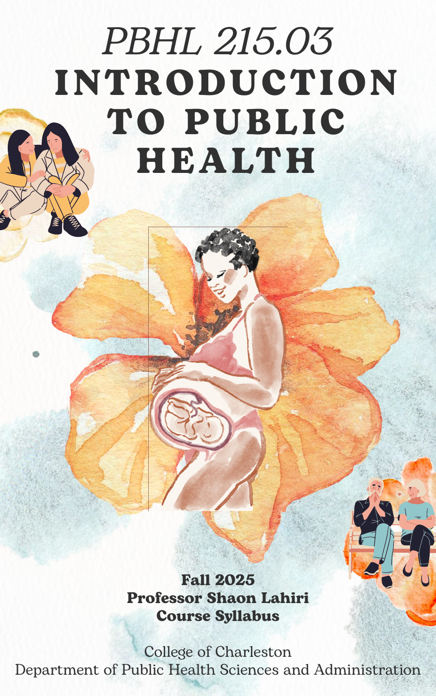
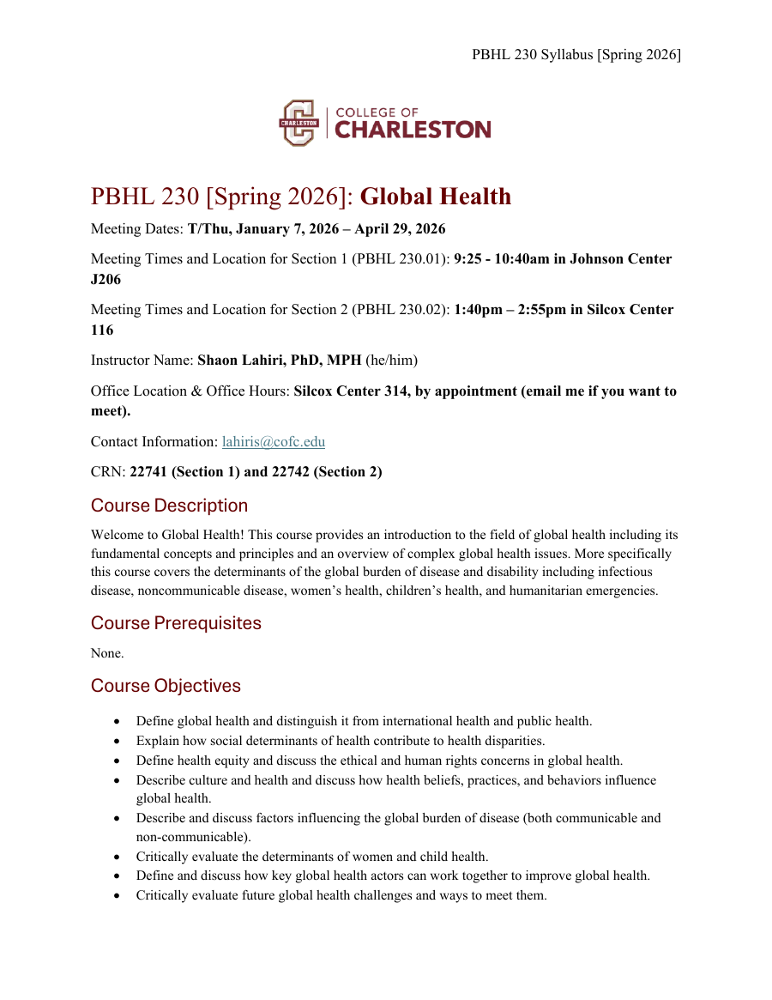
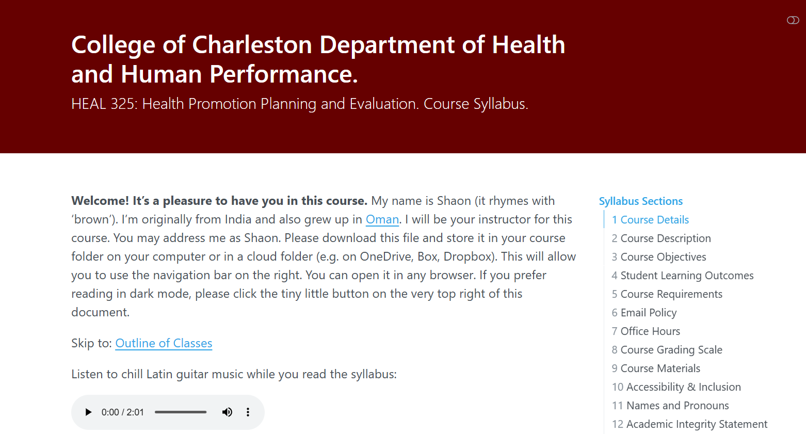

I have been teaching undergraduate and Master's students since 2018, and greatly enjoy the process of developing course content and teaching. I have experience teaching courses in-person, online, and in a hybrid model. The following are a list of courses for which I have either been a teaching assistant or a sole instructor. I've also provided three syllabi for undergraduate public health courses I developed. One is a visual syllabus, one is an accessible syllabus, and another is an interactive HTML syllabus.

## University of Illinois Urbana-Champaign

I develop and teach courses to undergraduate and Master's students in the College of Applied Health Sciences at the University of Illinois Urbana-Champaign.

**HK 110. Contemporary Health** (Fall 2026).

**HK 550. Research Methods in Health and Kinesiology** (Fall 2026).

## College of Charleston

I developed and taught courses for undergraduates in the public health program at the College of Charleston.

**PBHL 215. Introduction to Public Health** with a Special Focus on Race, Equity and Inclusion in Public Health Statistics (Fall 2025, Spring 2026).

[{width="45%" fig-align="left"}](files/pbhl215_f25_syllabus.pdf)

**Click the visual syllabus above to view or download the full PDF.**

**PBHL 230. Global Health** (Spring 2025, Fall 2025, Spring 2026).

[{width="45%" fig-align="left"}](files/pbhl230_s26_syllabus.pdf)

**Click the accessible syllabus above to view or download the full PDF.**

**PBHL 325. Health Promotion Planning and Evaluation** (Fall 2024, Spring 2025).

[{width="45%" fig-align="left"}](files/heal325_s25_syllabus.html)

**Click the syllabus above to open the interactive HTML file.**

## University of Pennsylvania

I developed and taught courses for undergraduates in the Philosophy, Politics & Economics (PPE) program at the University of Pennsylvania.

**PPE 4850. Advanced Seminar in Research Methods** (Spring 2024).

**PPE 4800. Social Norms, Networks, and Influence** (Fall 2023).

**PPE 4800. Theories of Behavior Change** (Spring 2023).

**PPE 4800. Unpacking the Black Box: Tackling Big Issues in Social & Behavioral Science Interventions** (Fall 2022).

**PPE 4000. Research Transparency, Reproducibility, and Basic Data Analysis in R** (Spring & Fall 2023).

## The George Washington University

I was a teaching assistant for undergraduate and MPH students for four years. I was also an adjunct lecturer for an online course (PUBH 6052) for one year.

**PUBH 6052. Practical Data Management and Analysis for Public Health** (Fall 2021 & Spring 2022).

**PUBH 6007. Social & Behavioral Approaches to Health** (Spring 2019, Spring 2020, Spring 2021, Fall 2021 & Spring 2022).

**PUBH 6504. Social & Behavioral Research Methods** (Fall 2018, Fall 2019 & Fall 2020).

**PUBH 6009**. **Fundamentals of Public Health Program Evaluation** (Spring 2020).

**PUBH 6503. Public Health Marketing** (Fall 2019).

**PUBH 4140. Writing in the Discipline of Public Health** (Spring 2019).
